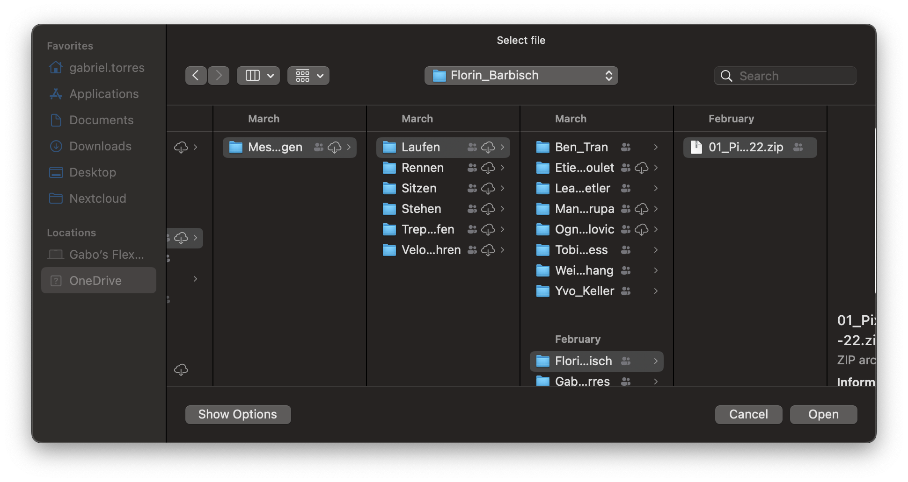
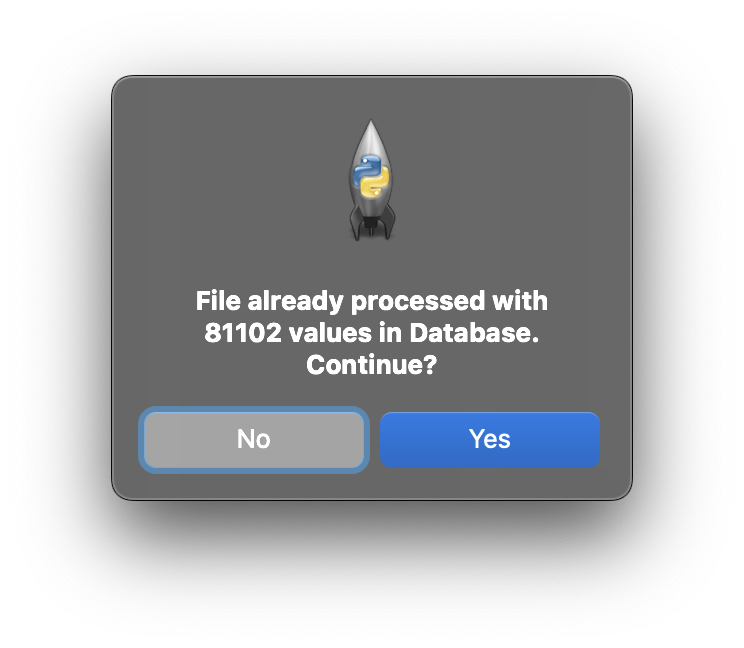
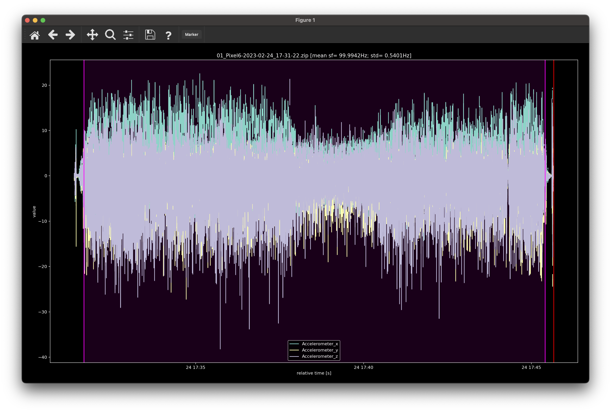
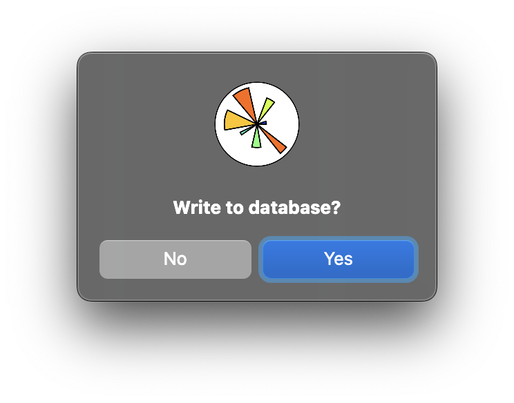

# blam
Blam ist unser Data Preprocessing Tool, welches uns hilft, die Daten von den Dateien zu extrahieren, zurechtzuschneiden, auf 100Hz zu downsamplen und in die Datenbank zu schreiben.

## Einstellungen
In den Einstellungen kann die Verbindung zur Datenbank (Dev und Prod), die zu selektierenden Daten und der Root Pfad angepasst werden. 
Die Einstellugnen sind in der [config.json](config.json) Datei erfasst.
Unsere QuestDB Datenbank kann nur über Tailscale erreicht werden, Zugriff dazu muss über [@gabrieltorresgamez](https://github.com/gabrieltorresgamez) angefordert werden.

## Anleitung
Um das Tool zu starten, muss die [app.py](app.py) mit folgenden Befehlen gestartet werden:

```bash
pip install -r requirements.txt
python app.py
```
### Dateiselektion
Bei der Dateiselektion muss jetzt eine von der App "Sensor Logger" generierte Datei (.json oder .zip) ausgewählt werden. Diese wird automatisch eingelesen und auf 100Hz gesampled.



### Daten bereits in der Datenbank
Falls Daten dieser Datei bereits in der Datenbank vorhanden sind, gibt das Tool eine Meldung aus. Hier muss entschieden werden, ob man die Datei trotzdem öffnen will.



### Datensnipper
Nach dem öffnen der Datei öffnet sich das Fenser zum zurechtschneiden der Datei.
Hier werden die Accelerometerdaten Daten zur Orientation geplottet.
Mit dem Marker kann man den Bereich markieren, welcher exportiert werden soll.
Die restlichen Features werden natürlich mit dem gleichen Zeitbereich exportiert.
Um die Änderungen zu speichern, muss man das Fenster schliessen.



### Datensicherung
Im letzten Schritt werden die Daten in die Datenbank exportiert. Dafür muss man folgenden Prompt akzeptieren:



### Danach?
Nachdem die Daten exportiert wurden sollten sie über das WebGUI von QuestDB verfügbar sein.
Man kann die nächste Datei einlesen.